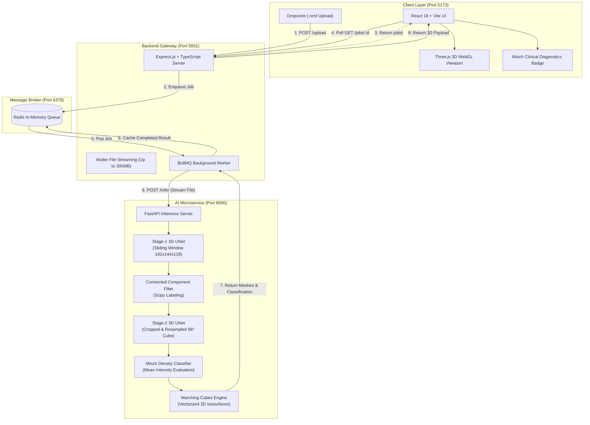

# 🦷 Bone Density Prediction & 3D Dental Implant Planning Platform

[](https://www.python.org/)
[](https://pytorch.org/)
[](https://monai.io/)
[](https://fastapi.tiangolo.com/)
[](https://nodejs.org/)
[](https://www.typescriptlang.org/)
[](https://react.dev/)
[](https://threejs.org/)
[](https://tailwindcss.com/)
[](https://redis.io/)

**Author:** Kundena Ramcharan Goyf  
**Repository:** [github.com/Ramcharan10122005/Bone-density-Prediction](https://github.com/Ramcharan10122005/Bone-density-Prediction)

> An end-to-end full-stack 3D medical AI platform for autonomous dental implant site localization, 3D anatomical isosurface reconstruction, and Misch bone density classification from Cone-Beam Computed Tomography (CBCT) volumes.

---

## 🌟 Overview

In clinical dental implantology, accurate preoperative assessment of bone quality and surgical implant trajectory is paramount to achieve high primary stability and avoid vital anatomical hazards (such as the inferior alveolar nerve canal or maxillary sinus perforation).

**Key Capabilities:**
1. **Ingests Raw 3D CBCT Scans**: Accepts `.nrrd` volumetric patient scans.
2. **Dual-Stage 3D Neural Segmentation**: Uses a coarse-to-fine cascaded 3D UNet architecture implemented in MONAI/PyTorch to first identify the edentulous alveolar bone socket and then delineate the planned implant fixture.
3. **Connected-Component Filtration**: Automatically strips away distant false-positive noise islands to present a clean, isolated surgical site.
4. **Misch Bone Quality Classification**: Quantitatively evaluates local CT attenuation (Hounsfield units) within the osteotomy bed to classify bone quality into **D1, D2, D3, or D4**, providing evidence-based drilling guidance.
5. **GPU-Accelerated 3D WebGL Viewer**: Renders an interactive 3D digital twin using Three.js, allowing clinicians to rotate, zoom, inspect internal cortical margins, and toggle translucent or wireframe bone views.

---

## 🏗️ System Architecture



---

## 🧠 Deep Learning Pipeline Breakdown

### 1. Stage 1: Alveolar Bone Socket Localization
- **Architecture**: 3D UNet (`spatial_dims=3`, `in_channels=1`, `out_channels=2`, `channels=(16, 32, 64, 128, 256)`, `strides=(2, 2, 2, 2)`, `num_res_units=2`, `norm="INSTANCE"`, `dropout=0.2`).
- **Inference Strategy**: Sliding window inference with patch size `(192, 144, 128)` and `overlap=0.5`.
- **Target**: Identifies the local surgical alveolar bone bed (**Label 6 / ROI 36**) from the patient's full whole-head CBCT volume.

### 2. Connected-Component Analysis & Bounding-Box Cropping
- **Filtration**: Discards small disconnected false-positive islands using `scipy.ndimage.label`.
- **Bounding Box**: Computes 3D coordinates `[z_min:z_max, y_min:y_max, x_min:x_max]` of the primary surgical site with a 20-voxel safety margin.
- **Normalization**: Resamples the candidate subvolume to an isometric $96^3$ cube via nearest-neighbor interpolation.

### 3. Stage 2: Implant Fixture Segmentation
- **Architecture**: Deep 3D UNet (`spatial_dims=3`, `in_channels=1`, `out_channels=2`, `channels=(32, 64, 128, 256, 512)`, `strides=(2, 2, 2, 2)`, `num_res_units=2`, `norm="INSTANCE"`, `dropout=0.2`).
- **Target**: Precisely isolates the implant body or osteotomy channel (**Label 7**) within the cropped $96^3$ spatial cube.

### 4. Vectorized 3D Isosurface Generation
- Applies the Lewiner Marching Cubes algorithm (`skimage.measure.marching_cubes`, `level=0.5`).
- Stage-2 vertices are automatically translated and rescaled back into patient global coordinate space, ensuring 1:1 anatomical alignment with the jaw socket.

---

## 🩺 Anatomical Labels & Clinical Explanation

Raw CBCT segmentations contain multiple anatomical layers. The platform isolates the surgical region of interest:

| Label | Anatomical Structure | Role in Platform |
|:---:|---|---|
| `Label 1` | *Maxilla & Upper Skull* | Background anatomy (~1.9M voxels) |
| `Label 2` | *Mandible* | Full lower jaw bone (~2.0M voxels) |
| `Label 3-4` | *Dentition (Upper & Lower)* | Teeth boundaries |
| `Label 5` | *Inferior Alveolar Canal* | Mandibular nerve canal |
| **`Label 6`** | **Alveolar Bone Socket (ROI)** | **Stage-1 Target**: Local bone bed surrounding the tooth site (~70K voxels) |
| **`Label 7`** | **Implant Fixture** | **Stage-2 Target**: Titanium implant cylinder / osteotomy defect (~24K voxels) |

```
              [ Alveolar Bone Socket (Label 6) ]
              Translucent grey-blue outer boundary
                     ┌──────────────────┐
                     │   ┌──────────┐   │
                     │   │ ░░░░░░░░ │   │  ◄── [ Titanium Implant (Label 7) ]
                     │   │ ░░░░░░░░ │   │      Bright Cyan Metallic Body
                     │   └──────────┘   │
                     └──────────────────┘
```

---

## 📊 Misch Bone Density Classification Matrix

Bone density is evaluated using the normalized mean CBCT intensity inside the predicted implant volume:

| Class | Anatomical Description | Typical Location | Estimated HU | Clinical Surgical Protocol |
|:---:|---|---|:---:|---|
| **D1** | Dense compact cortical bone | Anterior Mandible | $> 1250$ HU | Very high initial primary stability ($>45$ Ncm). Full-length tap drill required; copious irrigation to prevent thermal osteonecrosis. |
| **D2** | Thick porous cortical & coarse trabecular | Post. Mandible / Ant. Maxilla | $850 - 1250$ HU | Optimal osseointegration bed. Standard osteotomy drilling protocol with high primary stability ($35-45$ Ncm). |
| **D3** | Thin porous cortical & fine trabecular | Posterior Maxilla | $350 - 850$ HU | Moderate resistance. Consider slight undersized osteotomy to improve crestal engagement; target torque $25-35$ Ncm. |
| **D4** | Fine trabecular bone (very low density) | Maxillary Tuberosity | $150 - 350$ HU | Low resistance. Utilize osseodensification / bone condensing burs without final twist drill; wider diameter implant recommended. |

---

## 📁 Repository Structure

```
implant-platform/
├── .gitattributes             # Git LFS configuration for .pth model weights
├── .gitignore                 # Universal gitignore for Node, Python, and private scans
├── README.md                  # Comprehensive platform documentation
│
├── ml-service/                # 🐍 Python FastAPI Microservice
│   ├── models/                # Trained weights:
│   │   ├── best_stage1_model.pth  (Stage-1 UNet weights, ~18MB)
│   │   └── best_stage2_model.pth  (Stage-2 UNet weights, ~73MB)
│   ├── reference/             # Original research notebook (lol-idk.ipynb)
│   ├── sample_data/           # Directory for user-provided test scans (.gitkeep tracked)
│   ├── pipeline.py            # End-to-end inference & Marching Cubes pipeline
│   ├── verify_pipeline.py     # Independent ground-truth benchmark script
│   ├── main.py                # FastAPI endpoints & model memory caching
│   └── requirements.txt       # Pinned dependencies (MONAI, Torch, SimpleITK)
│
├── backend/                   # 🟢 Express + TypeScript Proxy
│   ├── src/
│   │   ├── index.ts           # REST API (/upload, /jobs/:id, /health)
│   │   └── queue.ts           # BullMQ Redis queue & background worker
│   ├── uploads/               # Temporary scan directory (.gitkeep tracked)
│   ├── .env.example           # Environment variables template
│   ├── package.json
│   └── tsconfig.json
│
└── frontend/                  # ⚛️ React 18 + Vite + Three.js Client
    ├── src/
    │   ├── components/
    │   │   ├── Viewer3D.tsx         # Interactive Three.js WebGL canvas
    │   │   ├── BoneQualityBadge.tsx # Clinical Misch diagnosis card
    │   │   ├── MetricsCard.tsx      # Volumetric metrics & matrix dimensions
    │   │   └── UploadZone.tsx       # Drag-and-drop .nrrd file uploader
    │   ├── App.tsx            # Main application orchestrator
    │   ├── main.tsx           # React entry point
    │   └── index.css          # TailwindCSS design system & themes
    ├── tailwind.config.js     # Tailwind configuration
    ├── postcss.config.js      # PostCSS configuration
    ├── vite.config.ts         # Reverse proxy to backend
    ├── index.html             # HTML shell with Google Fonts
    └── package.json
```

---

## 🔒 Privacy Notice on Patient Imaging Data

> In strict adherence to medical data confidentiality and healthcare privacy standards, **raw patient CBCT volumetric scans (`*.nrrd`, `*.seg.nrrd`) are not included in this public repository**.
>
> To test the pipeline locally, clinicians and researchers can place their own de-identified CBCT volumes in:
> ```
> ml-service/sample_data/your_scan.nrrd
> ```

---

## ⚡ Quick Start Guide

### Prerequisites
- **Node.js**: v18.0.0 or higher
- **Python**: v3.10 to v3.13
- **Redis Server**: v6.0 or higher
- **Git & Git LFS**: For model weights

---

### 1. Clone the Repository

```bash
# Clone via SSH:
git clone git@github.com:Ramcharan10122005/Bone-density-Prediction.git
cd Bone-density-Prediction

# Or clone via HTTPS:
git clone https://github.com/Ramcharan10122005/Bone-density-Prediction.git
cd Bone-density-Prediction

# Pull model weights tracked via Git LFS
git lfs install
git lfs pull
```

---

### 2. Start the Redis Broker

```bash
# On macOS (via Homebrew):
brew services start redis

# On Linux (Ubuntu/Debian):
sudo systemctl start redis

# Or run directly in terminal:
redis-server
```
*Verify connection with `redis-cli ping` (should return `PONG`).*

---

### 3. Launch the ML Microservice

```bash
cd ml-service

# Create and activate Python virtual environment
python3 -m venv .venv
source .venv/bin/activate  # On Windows: .venv\Scripts\activate

# Install dependencies
pip install -r requirements.txt

# Start FastAPI server
uvicorn main:app --host 0.0.0.0 --port 8000 --reload
```
- API Base URL: `http://localhost:8000`
- Swagger Interactive Documentation: `http://localhost:8000/docs`

---

### 4. Launch the Backend Gateway

In a new terminal:

```bash
cd backend

# Install dependencies
npm install

# Copy environment variables
cp .env.example .env

# Start development server
npm run dev
```
- Gateway URL: `http://localhost:5001`
- Health Endpoint: `http://localhost:5001/health`

---

### 5. Launch the Frontend Interface

In a new terminal:

```bash
cd frontend

# Install dependencies
npm install

# Start Vite development server
npm run dev
```
- Web Application: **`http://localhost:5173`**

---

## 📡 API Reference

### Backend Endpoints (`http://localhost:5001`)

#### `POST /upload`
Uploads a `.nrrd` 3D scan and enqueues a background inference job.
- **Content-Type**: `multipart/form-data`
- **Body**: `file: <binary .nrrd file>` (supports up to 300MB)
- **Response** (`202 Accepted`):
  ```json
  {
    "jobId": "job-d6747eef",
    "status": "queued",
    "message": "Scan uploaded and queued for ML inference."
  }
  ```

#### `GET /jobs/:id`
Polls the execution state and retrieves the full segmentation and 3D mesh result.
- **Parameters**: `id` (e.g. `job-d6747eef`)
- **Response** (`200 OK`):
  ```json
  {
    "id": "job-d6747eef",
    "status": "completed",
    "progress": 100,
    "result": {
      "bone_quality": "D3",
      "implant_volume_voxels": 20,
      "mean_intensity": 0.3413,
      "roi_mesh": {
        "vertices": [[12.4, 45.1, 98.2], "..."],
        "faces": [[0, 1, 2], "..."]
      },
      "implant_mesh": {
        "vertices": [[15.2, 47.3, 101.0], "..."],
        "faces": [[0, 1, 2], "..."]
      },
      "crop_bbox": {
        "zmin": 0, "zmax": 242,
        "ymin": 0, "ymax": 472,
        "xmin": 0, "xmax": 472
      },
      "volume_shape": [243, 473, 473]
    },
    "error": null
  }
  ```

#### `GET /health`
Returns connection status for Redis and the BullMQ worker cluster.

---

## 🧪 Ground-Truth Verification Script

An independent evaluation script is included to benchmark the pipeline against ground-truth segmentations:

```bash
cd ml-service
./.venv/bin/python verify_pipeline.py \
  --image "sample_data/your_scan.nrrd" \
  --label "sample_data/your_segmentation.seg.nrrd"
```

The script reports:
- Stage-1 ROI Dice & Intersection over Union (IoU)
- Stage-2 Implant Dice score & volumetric error percentage
- Extracted surface vertex and polygon counts
- Misch classification consistency

---

## 🚀 Pushing to GitHub

To push this repository to your GitHub account:

```bash
# 1. Stage the updated files
git add .

# 2. Commit the changes
git commit -m "feat: initial commit of bone density prediction and dental implant platform"

# 3. Ensure the branch is named main
git branch -M main

# 4. Link your GitHub remote
git remote add origin git@github.com:Ramcharan10122005/Bone-density-Prediction.git

# 5. Push to GitHub
git push -u origin main
```

---

## ⚠️ Medical Device Disclaimer

> **DISCLAIMER**: This software is intended strictly for research, scientific evaluation, and educational surgical planning purposes. It has not been cleared or approved by the US FDA, CE, or any other medical regulatory authority for diagnostic or therapeutic use. Clinical decisions must always be made by a licensed dental surgeon or radiologist using certified medical equipment.
